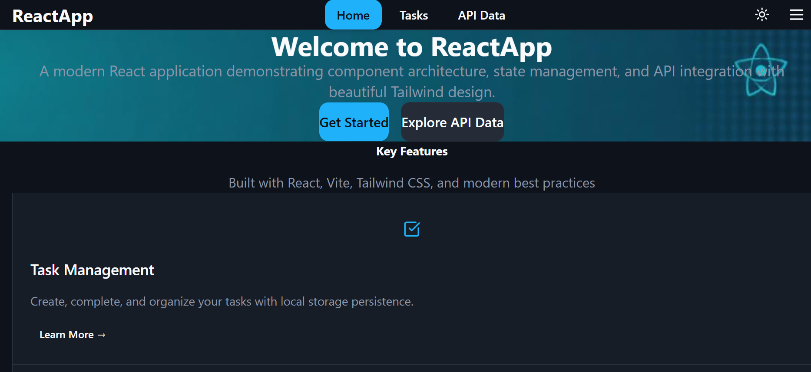
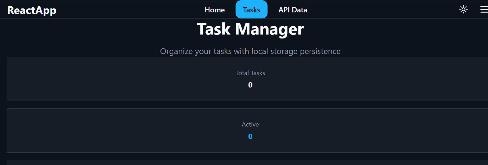
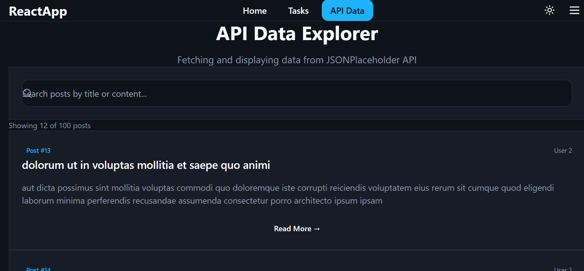

HEAD
# React.js and Tailwind CSS Assignment

This assignment focuses on building a responsive React application using JSX and Tailwind CSS, implementing component architecture, state management, hooks, and API integration.

## Assignment Overview

You will:
1. Set up a React project with Vite and Tailwind CSS
2. Create reusable UI components
3. Implement state management using React hooks
4. Integrate with external APIs
5. Style your application using Tailwind CSS

## Getting Started

1. Accept the GitHub Classroom assignment invitation
2. Clone your personal repository that was created by GitHub Classroom
3. Install dependencies:
   ```
   npm install
   ```
4. Start the development server:
   ```
   npm run dev
   ```

## Files Included

- `Week3-Assignment.md`: Detailed assignment instructions
- Starter files for your React application:
  - Basic project structure
  - Pre-configured Tailwind CSS
  - Sample component templates

## Requirements

- Node.js (v18 or higher)
- npm or yarn
- Modern web browser
- Code editor (VS Code recommended)

## Project Structure

```
src/
├── components/       # Reusable UI components
├── pages/           # Page components
├── hooks/           # Custom React hooks
├── context/         # React context providers
├── api/             # API integration functions
├── utils/           # Utility functions
└── App.jsx          # Main application component
```

## Submission

Your work will be automatically submitted when you push to your GitHub Classroom repository. Make sure to:

1. Complete all required components and features
2. Implement proper state management with hooks
3. Integrate with at least one external API
4. Style your application with Tailwind CSS
5. Deploy your application and add the URL to your README.md

## Resources

- [React Documentation](https://react.dev/)
- [Tailwind CSS Documentation](https://tailwindcss.com/docs)
- [Vite Documentation](https://vitejs.dev/guide/)
- [React Router Documentation](https://reactrouter.com/) 

# React Task Manager & API Explorer

A modern, responsive React application demonstrating component architecture, state management, API integration, and beautiful Tailwind CSS styling with dark/light mode support.


## 📋 Project Overview

This project is a comprehensive React application built with Vite that showcases modern web development practices. It features a task management system with local storage persistence, API data fetching with pagination and search, and a responsive design that adapts seamlessly across devices.

## ✨ Features

- **Task Management System**
  - Create, complete, and delete tasks
  - Filter tasks by status (All, Active, Completed)
  - Persistent storage using localStorage
  - Real-time task statistics

- **API Data Integration**
  - Fetch data from JSONPlaceholder API
  - Search functionality to filter posts
  - Pagination with dynamic page numbers
  - Loading and error state handling

- **Theme System**
  - Light and dark mode toggle
  - Persistent theme preference
  - Smooth transitions between themes
  - System preference detection

- **Responsive Design**
  - Mobile-first approach
  - Adaptive layouts for all screen sizes
  - Touch-friendly interactions
  - Optimized for tablets and desktops

- **Modern UI/UX**
  - Clean, professional design
  - Smooth animations and transitions
  - Intuitive navigation
  - Accessibility-focused components

## 🛠 Tech Stack

- **Frontend Framework:** React 18
- **Build Tool:** Vite 5
- **Styling:** Tailwind CSS 3
- **Routing:** React Router DOM 6
- **State Management:** React Hooks + Context API
- **Icons:** Lucide React
- **Notifications:** Sonner
- **HTTP Client:** Fetch API
- **Type Safety:** TypeScript (optional)

## 📁 Folder Structure

```
src/
├── components/
│   ├── Button.jsx          # Reusable button with variants
│   ├── Card.jsx            # Card component for content display
│   ├── Navbar.jsx          # Navigation with theme toggle
│   ├── Footer.jsx          # Footer with social links
│   └── Layout.jsx          # Layout wrapper component
├── pages/
│   ├── Home.jsx            # Landing page with features
│   ├── Tasks.jsx           # Task management interface
│   └── ApiData.jsx         # API data explorer with search
├── hooks/
│   └── useLocalStorage.js  # Custom hook for localStorage
├── context/
│   └── ThemeContext.jsx    # Theme provider and context
├── utils/
│   └── api.js              # API utility functions
├── assets/
│   └── hero-image.jpg      # Hero section image
├── App.tsx                 # Main app component with routing
├── main.tsx                # Application entry point
└── index.css               # Global styles and design tokens
```

## 🚀 Installation

### Prerequisites

- Node.js (v16 or higher)
- npm or yarn

### Setup Steps

1. **Clone the repository**
   ```bash
   git clone <your-repo-url>
   cd react-task-api-app
   ```

2. **Install dependencies**
   ```bash
   npm install
   ```

3. **Start development server**
   ```bash
   npm run dev
   ```

4. **Open your browser**
   Navigate to `http://localhost:8080`

## 📦 Available Scripts

```bash
npm run dev      # Start development server
npm run build    # Build for production
npm run preview  # Preview production build
npm run lint     # Run ESLint
```

## 📸 Screenshots

### Homepage

*Modern landing page with hero section and feature cards*

### Task Manager

*Full-featured task management with filtering and statistics*

### API Data Explorer

*API data display with search and pagination*

## 🎨 Design System

The application uses a comprehensive design system with semantic tokens:

- **Colors:** HSL-based color palette with light/dark variants
- **Typography:** System font stack with responsive sizing
- **Spacing:** Consistent spacing scale
- **Shadows:** Layered shadow system
- **Animations:** Smooth transitions and micro-interactions

## 🌐 API Integration

The app integrates with [JSONPlaceholder](https://jsonplaceholder.typicode.com/), a free fake REST API for testing and prototyping.

**Endpoints used:**
- `GET /posts` - Fetch all posts

**Features:**
- Error handling with user-friendly messages
- Loading states with spinners
- Search and filter functionality
- Client-side pagination

## 📱 Responsive Design

Breakpoints:
- **Mobile:** < 768px
- **Tablet:** 768px - 1024px
- **Desktop:** > 1024px

All components are fully responsive and tested across devices.

## 🎯 Key Learnings

This project demonstrates:
- Component composition and reusability
- State management with hooks and Context API
- Custom hooks for cross-cutting concerns
- API integration with error handling
- Local storage for data persistence
- Theme implementation with CSS variables
- Responsive design with Tailwind CSS
- Clean code architecture and file organization

## 🚀 Deployment

### Deploy to Vercel

1. Push your code to GitHub
2. Import project in Vercel
3. Deploy with default settings

### Deploy to Netlify

1. Run `npm run build`
2. Drag the `dist` folder to Netlify
3. Configure redirects for SPA routing

**Live Demo:** [View on Vercel](https://your-app.vercel.app)

## 👤 Author

**Jackline Karimi**

- Portfolio: [Your Portfolio URL]
- GitHub: [@yourhandle](https://github.com/yourhandle)
- LinkedIn: [Your LinkedIn](https://linkedin.com/in/yourprofile)
- Email: jackline@example.com

## 📄 License

This project is licensed under the MIT License - see the [LICENSE](LICENSE) file for details.

## 🙏 Acknowledgments

- [React Documentation](https://react.dev/)
- [Tailwind CSS](https://tailwindcss.com/)
- [Vite](https://vitejs.dev/)
- [JSONPlaceholder](https://jsonplaceholder.typicode.com/)
- [Lucide Icons](https://lucide.dev/)

## 🤝 Contributing

Contributions, issues, and feature requests are welcome!

1. Fork the project
2. Create your feature branch (`git checkout -b feature/AmazingFeature`)
3. Commit your changes (`git commit -m 'Add some AmazingFeature'`)
4. Push to the branch (`git push origin feature/AmazingFeature`)
5. Open a Pull Request

---

⭐ If you found this project helpful, please give it a star!
 lovable/main
